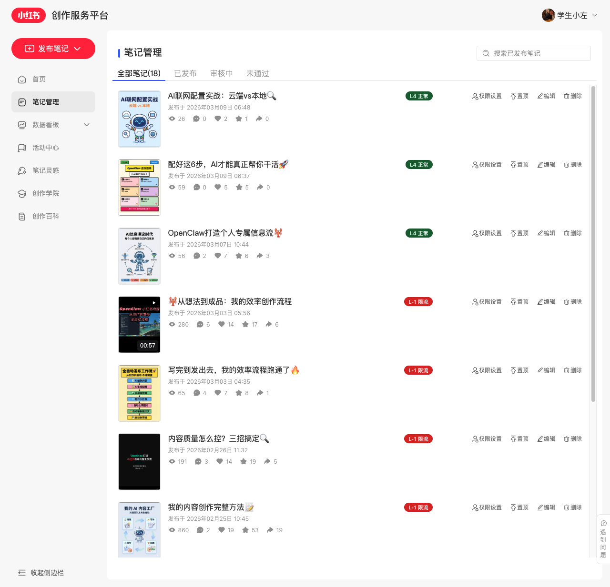

# XHS Note Health Checker 🩺

Chrome 扩展：在小红书创作者后台**笔记管理页**一眼看清每篇笔记的限流状态。



## 功能

- 🏷️ **Level Badge** — 每篇笔记标题后显示彩色限流状态标签
- ⚠️ **敏感词检测** — 标题含高危词自动标红警告
- 📛 **标签数量检测** — 话题标签 >5 个提示风险
- 📊 **Popup 面板** — 点击图标查看全部笔记 Level 分布 + 限流诊断
- 📈 **历史追踪** — 自动记录每篇笔记 Level 变化趋势 ↑↓→

## Level 说明（逆向推断，仅供参考）

| Level | 状态 | 说明 |
|-------|------|------|
| 4 🟢 | 正常推荐 | 笔记正常分发 |
| 2 🟡 | 基本正常 | 轻微受限 |
| 1 ⚪ | 新帖初始 | 刚发布，等待审核 |
| -1 🔴 | 轻度限流 | 推荐量明显下降 |
| -5 🔴🔴 | 中度限流 | 几乎无推荐 |
| -102 ⛔ | 严重限流 | 不可逆，需删除重发 |

## 安装

### Chrome Web Store
> 审核中，敬请期待

### 手动安装（开发者模式）

1. [下载最新 Release](../../releases/latest) 的 `chrome-mv3-prod.zip`
2. 解压到任意文件夹
3. 打开 `chrome://extensions/`
4. 开启右上角 **开发者模式**
5. 点击 **加载已解压的扩展程序** → 选择解压后的文件夹
6. 打开 [小红书创作者后台](https://creator.xiaohongshu.com/new/note-manager) → 笔记管理

## 工作原理

扩展通过拦截创作者后台的 API 响应（`/api/galaxy/v2/creator/note/user/posted`），读取返回数据中每篇笔记的 `level` 字段，然后在页面上注入对应颜色的 Badge。

- **不会发送任何数据到外部服务器**
- 所有数据存储在本地 `localStorage` 和 `chrome.storage.local`
- 仅在 `creator.xiaohongshu.com` 域名下运行

## 开发

```bash
pnpm install
pnpm dev     # 开发模式，热重载
pnpm build   # 生产构建 + 打包 zip
```

## 敏感词库

当前内置检测词：`自动化` `自动发布` `AI生成` `内容工厂` `批量` `全自动` `自动工作流` `AI自动`

可在 `src/lib/xhs.ts` 的 `SENSITIVE_WORDS` 数组中自定义。

## 灵感来源

- [Ceelog/note-limited-finder](https://github.com/Ceelog/note-limited-finder) — 最早的 XHS Level 检测扩展
- 本项目在其基础上增加了：敏感词诊断、标签数量检测、历史追踪、Popup 面板

## License

MIT
